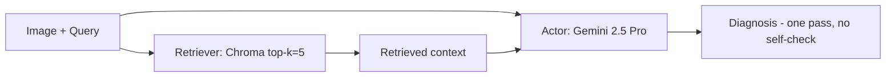
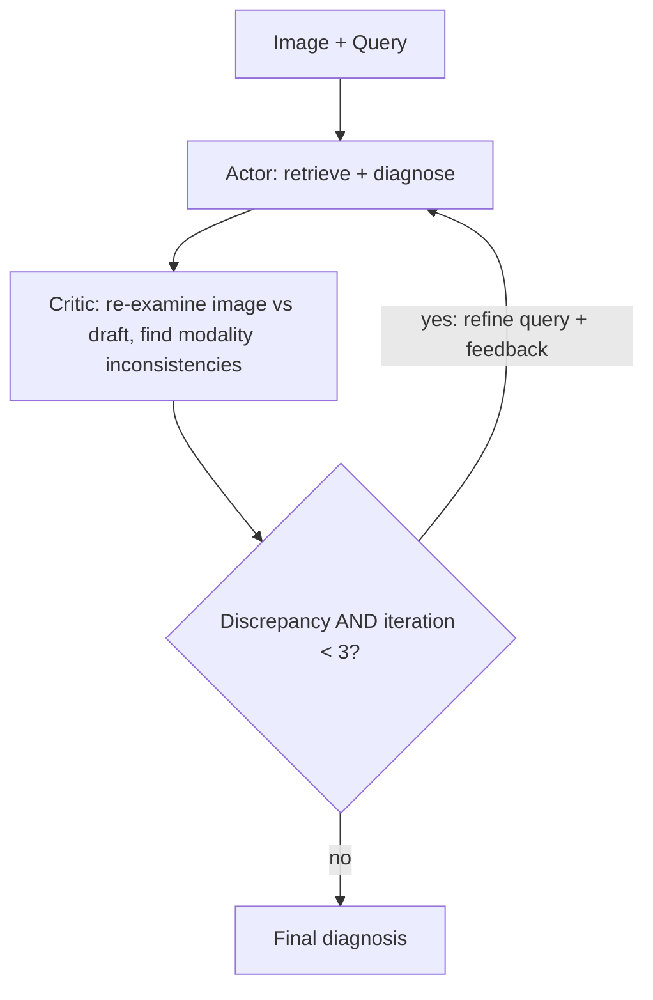
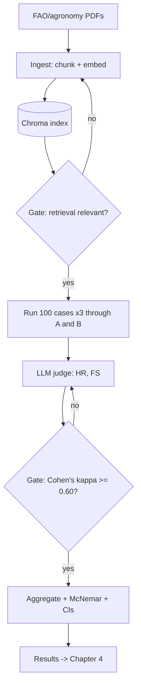

<!--
  MASTER'S REPORT — working draft.
  RESULTS (Chapter 4) ARE PLACEHOLDERS. Every value marked [TBD] or "pending run"
  is NOT yet measured. Populate only from eval/results/benchmark_raw.csv after the
  real benchmark run. Do not present placeholders as findings.
-->

# Evaluating Multi-Agent Reflection Loops for Reducing Hallucinations in Multimodal Agricultural Diagnostics

Report for the degree of **Master of Computer Science**

**BISHAL BHATTARAI**
LUC0003001759

Phoenix College of Management
MCS Department, Lincoln University, Malaysia
April, 2026

---

## Declaration

I hereby declare that this study entitled *"Evaluating Multi-Agent Reflection Loops for Reducing Hallucinations in Multimodal Agricultural Diagnostics"* is based on my original research work. Related works on the topic by other researchers have been duly acknowledged. I owe all the liabilities relating to the accuracy and authenticity of the data and any other information included hereunder.

---

## Acknowledgment

I would like to express my sincere gratitude to all those who supported me throughout my research on *"Evaluating Multi-Agent Reflection Loops for Reducing Hallucinations in Multimodal Agricultural Diagnostics."*

First and foremost, I thank my supervisor, **[Supervisor Name]**, for the guidance, mentorship, and insight that shaped the direction and quality of this work.

I also thank my colleagues and classmates, whose discussions and feedback enriched my understanding of the topic. I am grateful to the maintainers of the open agricultural datasets and knowledge sources used in this study, without which the evaluation would not have been possible.

Finally, I thank my family and friends for their unwavering support and encouragement throughout this research.

---

## Abstract

The integration of Multimodal Large Language Models (MLLMs) with Retrieval-Augmented Generation (RAG) offers a promising approach to digital agricultural diagnostics. However, such systems frequently suffer from *modality-misalignment hallucinations*, in which the model prioritises its internal parametric memory or retrieved text over conflicting visual evidence in a user-supplied image. In the high-stakes domain of crop pathology, such errors lead to incorrect treatment recommendations and avoidable yield loss.

This research investigates whether an autonomous multi-agent reflection loop reduces hallucinations relative to a standard single-pass pipeline. Two diagnostic systems are benchmarked on the same data: (A) a single-pass RAG baseline, and (B) a stateful Actor–Critic reflection loop implemented in LangGraph, in which a dedicated Critic agent cross-references the image against the retrieved agronomic text before a diagnosis is finalised. The evaluation uses 100 adversarial cases drawn from the PlantVillage repository and a 2025 Tomato Leaf Dataset — targeting diseases of high visual similarity but divergent treatment — together with a 20% subset of cross-domain queries testing contextual rejection. Performance is measured by Hallucination Rate, Faithfulness Score, inference latency, and rejection accuracy, using an LLM-as-judge that is itself validated against human annotators (Cohen's κ ≥ 0.60) before use.

> **Note on results.** The experimental run is in progress; Chapter 4 presents the evaluation design and result tables with placeholder cells (`[TBD]`). No performance figure in this report has been measured yet.

---

## List of Abbreviations

| Abbreviation | Meaning |
|---|---|
| MLLM | Multimodal Large Language Model |
| RAG | Retrieval-Augmented Generation |
| CNN | Convolutional Neural Network |
| ViT | Vision Transformer |
| HR | Hallucination Rate |
| FS | Faithfulness Score |
| KB | Knowledge Base |
| FAO | Food and Agriculture Organization |

## List of Figures

- Figure 1. System A — single-pass RAG baseline.
- Figure 2. System B — the Actor–Critic reflection loop.
- Figure 3. End-to-end evaluation pipeline and quality gates.

---

## Table of Contents

- **Chapter 1. Introduction** — 1.1 Background · 1.2 Motivation · 1.3 Statement of the Problem · 1.4 Objectives · 1.5 Significance · 1.6 Theoretical Framework · 1.7 Limitations
- **Chapter 2. Literature Review** — 2.1 Overview · 2.2 Computer Vision in Plant Pathology · 2.3 RAG and the Hallucination Problem · 2.4 Agentic AI and Multi-Agent Orchestration · 2.5 Reflection Loops and Self-Correction · 2.6 Benchmark Datasets · 2.7 Research Gap
- **Chapter 3. Methodology** — 3.1 Research Design · 3.2 Datasets · 3.3 Knowledge Base and Ingestion · 3.4 System A · 3.5 System B · 3.6 Evaluation Framework · 3.7 Judge Validation · 3.8 Implementation
- **Chapter 4. Results and Analysis** *(placeholders — pending run)* — 4.1 Dataset Summary · 4.2 Experimental Setup · 4.3 Judge-Validation Results · 4.4 Main Results (RQ1) · 4.5 Latency (RQ2) · 4.6 Cross-Domain Rejection (RQ3) · 4.7 Analysis
- **Chapter 5. Discussion and Conclusion** — 5.1 Summary · 5.2 Objectives Revisited · 5.3 Implications · 5.4 Threats to Validity · 5.5 Future Work

---

# Chapter 1. Introduction

## 1.1 Background

Early research in digital plant pathology relied on single-modal deep learning, using Convolutional Neural Networks (CNNs) such as ResNet and MobileNet for disease classification. Mohanty et al. (2016) demonstrated the feasibility of this approach, training deep CNNs on the PlantVillage dataset (Hughes & Salathé, 2015) to reach 99.35% classification accuracy under controlled laboratory conditions. However, a persistent generalisation gap emerged: models trained on clean, uniform images degraded sharply under real-field variation in lighting, camera angle, and background. Attention subsequently shifted toward Vision Transformers (ViTs) and Multimodal Large Language Models (MLLMs), which integrate visual symptoms with textual context for a more holistic assessment of crop health. To ground these models in current, domain-specific knowledge, Retrieval-Augmented Generation (RAG; Lewis et al., 2020) has become the standard technique.

## 1.2 Motivation

Crop diseases remain a major threat to global food security, with the FAO estimating annual yield losses on the order of 20–40%. In this setting a diagnostic error is not a mere technical failure: it leads to misapplication of fertiliser or pesticide, wasting capital, degrading the environment, and reducing yield. Farmers increasingly seek image-based, expert-level guidance through mobile interfaces, yet inaccurate model outputs create a *trust gap* that hinders adoption of precision-agriculture tools (Srinivasu et al., 2026). There is therefore an urgent need for AI systems that deliver high-fidelity, evidence-backed diagnostics.

## 1.3 Statement of the Problem

Despite the reasoning ability of state-of-the-art models, a critical barrier persists — *modality-misalignment hallucination*:

1. **Over-prioritisation of memory/text.** In single-pass RAG architectures the model often prioritises its parametric memory or the retrieved documentation over the specific visual evidence in the user's photograph.
2. **Visual ambiguity.** Diseases of high morphological similarity (e.g. Early Blight vs. Septoria Leaf Spot) lead models to ignore subtle visual markers in favour of a more "plausible" but incorrect retrieved answer.
3. **Lack of empirical evidence.** There is little empirical work on whether multi-agent reflection loops specifically reduce hallucinations caused by *visual* ambiguity in crop imagery, nor on the latency trade-off for mobile-first tools.

## 1.4 Objectives

This research investigates and quantifies the effectiveness of multi-agent reflection loops in mitigating factual hallucinations in agricultural diagnostics. Specific objectives:

- **O1 — Mitigation strategy.** Investigate how autonomous self-correction can resolve discrepancies between visual symptoms and retrieved agronomic data.
- **O2 — Benchmarking.** Contrast a single-pass RAG baseline against an iterative Actor–Critic framework under identical models, prompts, retriever, and corpus.
- **O3 — Reliability quantification.** Quantify reliability gains using Hallucination Rate (HR) and Faithfulness Score (FS).
- **O4 — Robustness.** Evaluate contextual rejection when the system is presented with out-of-scope (cross-domain) queries.

## 1.5 Significance of the Study

The primary contribution is a quantitative analysis of self-correction mechanisms in agricultural AI. By targeting the structural causes of modality misalignment, the work aims to (i) provide a technical framework for reliable, evidence-backed AI assistants; (ii) illustrate a transition from reactive, single-pass prediction toward deliberate, verify-before-answer reasoning — the "System 1 vs System 2" distinction of Kahneman (2011); and (iii) offer a defensible framework for mobile-first agricultural decision support.

## 1.6 Theoretical Framework

The architecture is grounded in the Actor–Critic pattern from reinforcement learning, adapted to language agents by Reflexion (Shinn et al., 2023):

- **Actor (Diagnostician)** — produces the initial diagnosis under the role of a plant pathologist.
- **Critic (Reflector)** — a skeptical auditor that identifies modality inconsistencies by cross-referencing the generated text against the image.
- **Verbal feedback loop** — the Critic emits natural-language feedback and a refined retrieval query, which are fed back to the Actor for the next iteration.

## 1.7 Limitations

- **Inference latency.** Iterative loops increase response time, in tension with real-time mobile use.
- **Connectivity dependency.** Cloud-hosted MLLMs require good network connectivity.
- **Sensor scope.** The system uses RGB imagery only; root-borne or nutrient disorders may require spectral or soil data not covered here.
- **Dataset realism.** PlantVillage images are largely captured against uniform backgrounds and may under-represent field conditions.

---

# Chapter 2. Literature Review

## 2.1 Overview

Digital agricultural diagnostics has evolved from single-label image classification toward multimodal reasoning. This review traces the progression of computer vision in plant pathology, the limitations of single-pass RAG, the emergence of agentic workflows, and the reflection loops this thesis evaluates.

## 2.2 Computer Vision in Plant Pathology

Mohanty et al. (2016) established the feasibility of CNN-based diagnosis on PlantVillage (Hughes & Salathé, 2015), but the resulting "generalisation gap" under field noise motivated a move to attention-based and multimodal architectures that treat image and text as jointly-encoded streams, enabling context-aware diagnosis rather than closed-set classification.

## 2.3 Retrieval-Augmented Generation and the Hallucination Problem

RAG (Lewis et al., 2020) grounds LLMs in an external corpus and reduces errors from stale parametric memory. However, in multimodal settings it introduces a new failure mode — *modality misalignment* — in which the model favours retrieved text over contradictory visual evidence. MultiRAG (Wu et al., 2025) addresses a related problem in text-only multi-source retrieval by constructing multi-source line graphs and applying multi-level confidence filtering to discard unreliable evidence before generation.

**Figure 1. System A — single-pass RAG baseline.**

## 2.4 Agentic AI and Multi-Agent Orchestration

The shift from passive models to *agentic AI* lets systems set goals, use tools, and coordinate. In agriculture, Srinivasu et al. (2026) describe frameworks in which specialised agents (soil monitoring, weather sensing, disease detection) collaborate for decentralised, real-time decision-making, combined with federated learning for privacy-preserving deployment.

## 2.5 Reflection Loops and Self-Correction

Reflexion (Shinn et al., 2023) introduced a framework in which an agent converts environment feedback into natural-language reflections stored in episodic memory, improving over trial-and-error. Reflection effectively simulates deliberate "System 2" reasoning (Kahneman, 2011) in place of the reactive "System 1" response of a single-pass LLM. Applied to diagnosis, an Actor–Critic loop lets a Critic surface unsupported claims before the answer is finalised.

**Figure 2. System B — the Actor–Critic reflection loop.**

## 2.6 Benchmark Datasets in Agricultural AI

PlantVillage (Hughes & Salathé, 2015) is widely used but criticised for its lack of real-world complexity. Newer multimodal resources evaluate richer behaviour: the CDDM dataset (Liu et al., 2024) provides ~137,000 images and ~1 million QA pairs for fine-grained diagnosis, and MIRAGE (Dongre et al., 2025) benchmarks expert consultative reasoning over 35,000+ real user–expert interactions. AgMMU (2025; arXiv:2504.10568) similarly targets comprehensive agricultural multimodal understanding. This study uses PlantVillage and a 2025 Tomato Leaf Dataset for its image cases, citing CDDM and MIRAGE as related multimodal benchmarks rather than as its evaluation source.

## 2.7 Research Gap

The literature supports RAG for agricultural knowledge and multi-agent systems for automation, but provides little empirical evidence on (i) whether reflection loops reduce hallucinations caused specifically by *visual* ambiguity, and (ii) the accuracy–latency trade-off for mobile-first deployment. This thesis addresses both.

---

# Chapter 3. Methodology

## 3.1 Research Design

The study uses a controlled comparative design contrasting **System A** (single-pass RAG) with **System B** (Actor–Critic reflection loop). The two systems share the same Actor model, base prompt, retriever, and knowledge base; the *only* difference is the addition of the Critic and the reflection loop. This isolation ensures any difference in the dependent variables is attributable to reflection, not to a confounding change in model, prompt, or corpus.

- **Independent variable:** inference architecture (A vs B).
- **Dependent variables:** Hallucination Rate, Faithfulness Score, inference latency, cross-domain rejection accuracy.

## 3.2 Datasets

- **Adversarial visual set (100 cases).** Curated from the PlantVillage repository (Hughes & Salathé, 2015) and a 2025 Tomato Leaf Dataset, selected for *visual-ambiguity factors* — diseases of high morphological similarity but divergent treatment (e.g. Early Blight vs. Septoria Leaf Spot). Each image is paired with a verified pathological label in `data/ground_truth.csv`.
- **Cross-domain robustness subset (20%).** Cases that pair an image of one species (e.g. potato) with a diagnostic request about another (e.g. corn); the correct response is refusal (label `REJECT`).
- **Knowledge base.** FAO diagnostic handbooks and 2025/2026 agronomy / regional extension manuals (PDF).

## 3.3 Knowledge Base and Ingestion

PDFs are extracted with `pypdf` and split with a recursive character splitter at **chunk size 1000 characters, overlap 150** (`config/config.py`). Chunks and queries are embedded with **`gemini-embedding-001`**, using task-type asymmetry (`RETRIEVAL_DOCUMENT` for the corpus, `RETRIEVAL_QUERY` for searches). Vectors are stored in a **local Chroma index** (top-k = 5), chosen for reproducible, offline re-evaluation. The Actor is instructed to tie every claim to a retrieved passage or the visual evidence, and to state when no supporting passage exists (*grounded generation*).

> **Note.** Images are passed directly to the multimodal API; there is no CNN-style pixel normalisation or resizing step, which does not apply to an MLLM API call.

## 3.4 System A — Single-Pass Baseline

`retrieve → diagnose` in a single model call, with no self-check (Figure 1). Implemented in `src/system_a_baseline.py`.

## 3.5 System B — Actor–Critic Reflection Loop

Implemented as a stateful graph in **LangGraph** (Figure 2), `src/system_b_reflection/`:

- **Actor (Diagnostician).** Google **Gemini 2.5 Pro**, role "plant pathologist", temperature **0.2** for reproducibility. Retrieves context and produces a diagnosis grounded in image + text.
- **Critic (Reflector).** **Gemini 2.5 Flash**, temperature **0.7** (higher → divergent, skeptical checking). Receives the image and the Actor's draft, and returns strict JSON: `has_discrepancy`, `contradictions`, `missing_symptoms`, and an optional `refined_query`.
- **Loop.** If the Critic reports a discrepancy, the graph routes back to the Actor with the feedback and refined query, forcing re-retrieval and revision. The loop is capped at **3 iterations** to bound latency and prevent over-correction; the final draft is returned.

## 3.6 Evaluation Framework

- **Hallucination Rate (HR):** fraction of generated claims unsupported by the image or the retrieved KB, scored by an LLM judge at the claim level per `prompts/judge_rubric.md`.
- **Faithfulness Score (FS):** RAGAS faithfulness (Es et al., 2023) — fraction of the answer's claims entailed by the retrieved context.
- **Inference latency:** end-to-end seconds per diagnostic cycle.
- **Rejection accuracy (RQ3):** fraction of cross-domain cases correctly refused.
- **Repetition & significance:** each case is run **3 times** per system (non-determinism); results are reported as mean ± standard deviation. Paired A-vs-B comparisons use **McNemar's test** for binary outcomes (any-hallucination, rejection-correct) and paired **confidence intervals** for continuous metrics.

## 3.7 Judge Validation

Because HR and FS are scored by an LLM judge, the judge is validated before it is trusted (`eval/judge_validation.py`). A stratified subset of **25–30** outputs is labelled independently by the researcher plus one to two annotators using the shared rubric, and by the LLM judge. Agreement is quantified with **Cohen's κ** (Fleiss' κ for three or more raters), and judge precision/recall against human labels is reported. The full benchmark proceeds only after **κ ≥ 0.60** ("substantial", Landis & Koch, 1977). To reduce self-bias the judge should use a different model family from the Actor/Critic; the current configuration reuses a Gemini model, noted as a threat to validity (§5.4).

## 3.8 Implementation

Python; orchestration via LangGraph; RAG via Chroma + `pypdf` + LangChain text splitters; evaluation via RAGAS and scikit-learn/statsmodels. All model calls route through a single swappable client (`src/llm/client.py`). The build order is gated (Figure 3): retrieval quality must be confirmed before agents are built, and judge agreement must reach κ ≥ 0.60 before the full benchmark runs.

**Figure 3. Evaluation pipeline and quality gates.**

---

# Chapter 4. Results and Analysis

> ⚠️ **Placeholder chapter.** The experimental run has not yet been executed. Every `[TBD]` below is unmeasured and must be populated **only** from `eval/results/benchmark_raw.csv`. Numbers shown are *not* findings.

## 4.1 Dataset Summary

- Total adversarial cases: **[TBD — target 100]**
- Ambiguous-disease cases: **[TBD — target 80]**
- Cross-domain cases: **[TBD — target 20]**
- Runs per case: 3 (per design)

## 4.2 Experimental Setup

- Actor: Gemini 2.5 Pro (T = 0.2) · Critic: Gemini 2.5 Flash (T = 0.7) · Judge: **[TBD — different family recommended]**
- Embeddings: `gemini-embedding-001` · Vector store: Chroma (top-k = 5)
- KB corpus size: **[TBD]** PDFs → **[TBD]** chunks
- Hardware/runtime: **[TBD]**

## 4.3 Judge-Validation Results (Gate)

| Metric | Value |
|---|---|
| Annotators | [TBD] |
| Cohen's / Fleiss' κ | **[TBD]** (proceed only if ≥ 0.60) |
| Judge precision (hallucinated) | [TBD] |
| Judge recall (hallucinated) | [TBD] |

## 4.4 Main Results — RQ1 (Hallucination & Faithfulness)

| Metric | System A (baseline) | System B (reflection) | Δ (B − A) | Paired test |
|---|---|---|---|---|
| Faithfulness Score (mean ± sd) | [TBD] | [TBD] | [TBD] | [TBD] |
| Hallucination Rate (mean ± sd) | [TBD] | [TBD] | [TBD] | McNemar p = [TBD] |

*Report Δ as both an absolute change (percentage points) and a relative change (%), and state the 95% CI. Do not conflate the two.*

## 4.5 Latency — RQ2

| Metric | System A | System B |
|---|---|---|
| Mean latency (s) | [TBD] | [TBD] |
| Mean iterations | 1 | [TBD] (≤ 3) |
| Overhead factor | — | [TBD]× |

## 4.6 Cross-Domain Rejection — RQ3

| System | Rejection accuracy on cross-domain cases |
|---|---|
| System A | [TBD] |
| System B | [TBD] |

## 4.7 Analysis

*To be written after the run. Discuss where reflection helped most (expected: high-morphological-similarity pairs such as Early Blight vs. Septoria), where it did not, the latency cost against the accuracy gain, and any failure modes observed in the Critic's feedback.*

---

# Chapter 5. Discussion and Conclusion

## 5.1 Summary of Findings

*To be finalised after Chapter 4.* This study set out to test whether a multi-agent Actor–Critic reflection loop reduces modality-misalignment hallucinations in multimodal agricultural diagnostics relative to a single-pass RAG baseline, and at what latency cost.

## 5.2 Objectives Revisited

Each objective (O1–O4, §1.4) will be addressed against the measured results: whether the Critic resolved visual–textual discrepancies (O1/O3), how the two pipelines compared (O2), and whether System B improved cross-domain rejection (O4).

## 5.3 Implications

If the reflection loop reduces hallucinations at acceptable latency, it offers a path toward trustworthy, evidence-backed mobile diagnostics and supports the broader move from reactive to deliberate reasoning in precision agriculture (Srinivasu et al., 2026).

## 5.4 Threats to Validity

- **Judge self-bias.** The judge currently shares the Gemini family with the Actor/Critic; a non-Gemini judge (e.g. GPT-4o or Claude) is recommended for the final run.
- **Dataset realism.** PlantVillage's uniform backgrounds may inflate accuracy relative to field conditions.
- **Non-determinism.** Mitigated by three runs per case and reported variance, but not eliminated.
- **Latency measurement.** Taken in a development environment; not a device-level mobile benchmark.

## 5.5 Future Work

- **Multi-sensor fusion:** incorporate hyperspectral or soil-sensor data for root-borne disorders.
- **On-device small models:** evaluate compact models to cut latency and remove the connectivity dependency.
- **Safety guardrails:** deterministic checks before any chemical-application recommendation.
- **Federated learning:** privacy-preserving, on-farm adaptation.

---

## References

Dongre, V., Gui, C., Garg, S., Nayyeri, H., Tur, G., Hakkani-Tür, D., & Adve, V. S. (2025). *MIRAGE: A Benchmark for Multimodal Information-Seeking and Reasoning in Agricultural Expert-Guided Conversations*. NeurIPS 2025. arXiv:2506.20100.

Es, S., James, J., Espinosa-Anke, L., & Schockaert, S. (2023). *RAGAS: Automated Evaluation of Retrieval Augmented Generation*. arXiv:2309.15217.

Hughes, D. P., & Salathé, M. (2015). *An open access repository of images on plant health to enable the development of mobile disease diagnostics* (PlantVillage). arXiv:1511.08060.

Kahneman, D. (2011). *Thinking, Fast and Slow*. Farrar, Straus and Giroux.

Landis, J. R., & Koch, G. G. (1977). The measurement of observer agreement for categorical data. *Biometrics*, 33(1), 159–174.

Lewis, P., Perez, E., Piktus, A., et al. (2020). *Retrieval-Augmented Generation for Knowledge-Intensive NLP Tasks*. NeurIPS 2020. arXiv:2005.11401.

Liu, X., Liu, Z., Hu, H., Chen, Z., Wang, K., Wang, K., & Lian, S. (2024). *A Multimodal Benchmark Dataset and Model for Crop Disease Diagnosis* (CDDM dataset). ECCV 2024. arXiv:2503.06973.

Mohanty, S. P., Hughes, D. P., & Salathé, M. (2016). Using deep learning for image-based plant disease detection. *Frontiers in Plant Science*, 7, 1419.

Shinn, N., Cassano, F., Berman, A., Gopinath, A., Narasimhan, K., & Yao, S. (2023). *Reflexion: Language Agents with Verbal Reinforcement Learning*. NeurIPS 2023. arXiv:2303.11366.

Srinivasu, P. N., Pavate, A., JayaLakshmi, G., Shafi, J., Choi, J., & Ijaz, M. F. (2026). *Agentic AI for smart and sustainable precision agriculture*. Frontiers in Plant Science. https://doi.org/10.3389/fpls.2025.1706428

Wu, W., Wang, H., Li, B., Huang, P., Zhao, X., & Liang, L. (2025). *MultiRAG: A Knowledge-guided Framework for Mitigating Hallucination in Multi-source Retrieval Augmented Generation*. 2025 IEEE 41st International Conference on Data Engineering (ICDE), 3070–3083. arXiv:2508.03553.

### Datasets

PlantVillage Dataset. Kaggle. https://www.kaggle.com/datasets/abdallahalidev/plantvillage-dataset

Tomato Leaf Disease Dataset (2025). Mendeley Data. https://data.mendeley.com/datasets/zfv4jj7855/1
