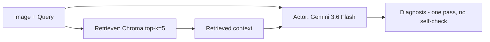
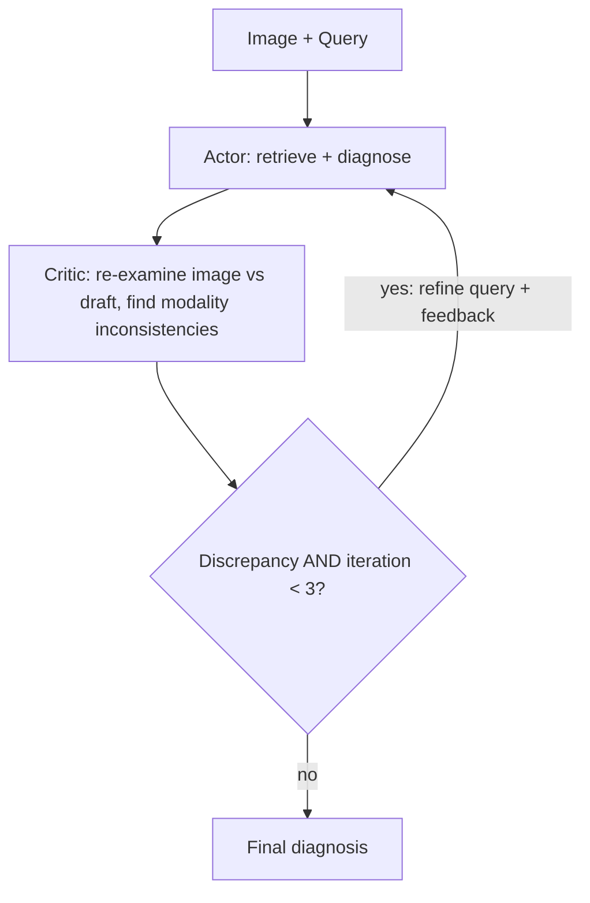
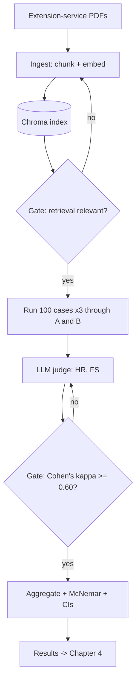

<!--
  MASTER'S REPORT — working draft.
  RESULTS (Chapter 4) ARE MEASURED as of 2026-09-20 (600 diagnoses, 0 failures).
  Only the judge-validation gate (4.3) remains [TBD] pending human annotation.
  is NOT yet measured. Populate only from eval/results/benchmark_raw.csv after the
  real benchmark run. Do not present placeholders as findings.
-->

# Evaluating Multi-Agent Reflection Loops for Reducing Hallucinations in Multimodal Agricultural Diagnostics

Report for the degree of **Master of Computer Science**

**BISHAL BHATTARAI**
LUC0003001759

Phoenix College of Management
MCS Department, Lincoln University, Malaysia
April, 2026

---

## Declaration

I hereby declare that this study entitled *"Evaluating Multi-Agent Reflection Loops for Reducing Hallucinations in Multimodal Agricultural Diagnostics"* is based on my original research work. Related works on the topic by other researchers have been duly acknowledged. I owe all the liabilities relating to the accuracy and authenticity of the data and any other information included hereunder.

---

## Acknowledgment

I would like to express my sincere gratitude to all those who supported me throughout my research on *"Evaluating Multi-Agent Reflection Loops for Reducing Hallucinations in Multimodal Agricultural Diagnostics."*

First and foremost, I thank my supervisor, **[Supervisor Name]**, for the guidance, mentorship, and insight that shaped the direction and quality of this work.

I also thank my colleagues and classmates, whose discussions and feedback enriched my understanding of the topic. I am grateful to the maintainers of the open agricultural datasets and knowledge sources used in this study, without which the evaluation would not have been possible.

Finally, I thank my family and friends for their unwavering support and encouragement throughout this research.

---

## Abstract

The integration of Multimodal Large Language Models (MLLMs) with Retrieval-Augmented Generation (RAG) offers a promising approach to digital agricultural diagnostics. However, such systems frequently suffer from *modality-misalignment hallucinations*, in which the model prioritises its internal parametric memory or retrieved text over conflicting visual evidence in a user-supplied image. In the high-stakes domain of crop pathology, such errors lead to incorrect treatment recommendations and avoidable yield loss.

This research investigates whether an autonomous multi-agent reflection loop reduces hallucinations relative to a standard single-pass pipeline. Two diagnostic systems are benchmarked on the same data: (A) a single-pass RAG baseline, and (B) a stateful Actor–Critic reflection loop implemented in LangGraph, in which a dedicated Critic agent cross-references the image against the retrieved agronomic text before a diagnosis is finalised. The evaluation uses 100 adversarial cases drawn from the PlantVillage repository — targeting diseases of high visual similarity but divergent treatment — together with a 20% subset of cross-domain queries testing contextual rejection. Performance is measured by Hallucination Rate, Faithfulness Score, inference latency, and rejection accuracy, using an LLM-as-judge that is itself validated against human annotators (Cohen's κ ≥ 0.60) before use.

> **Note on results.** The experimental run completed on 2026-09-20: 100 cases x 3 runs x 2 systems = 600 diagnoses, 0 unit failures. Chapter 4 reports measured values. The single exception is the judge-validation gate (4.3), which awaits human annotation; until it passes, all hallucination figures are provisional.

---

## List of Abbreviations

| Abbreviation | Meaning |
|---|---|
| MLLM | Multimodal Large Language Model |
| RAG | Retrieval-Augmented Generation |
| CNN | Convolutional Neural Network |
| ViT | Vision Transformer |
| HR | Hallucination Rate |
| FS | Faithfulness Score |
| KB | Knowledge Base |
| FAO | Food and Agriculture Organization |

## List of Figures

- Figure 1. System A — single-pass RAG baseline.
- Figure 2. System B — the Actor–Critic reflection loop.
- Figure 3. End-to-end evaluation pipeline and quality gates.

---

## Table of Contents

- **Chapter 1. Introduction** — 1.1 Background · 1.2 Motivation · 1.3 Statement of the Problem · 1.4 Objectives · 1.5 Significance · 1.6 Theoretical Framework · 1.7 Limitations
- **Chapter 2. Literature Review** — 2.1 Overview · 2.2 Computer Vision in Plant Pathology · 2.3 RAG and the Hallucination Problem · 2.4 Agentic AI and Multi-Agent Orchestration · 2.5 Reflection Loops and Self-Correction · 2.6 Benchmark Datasets · 2.7 Research Gap
- **Chapter 3. Methodology** — 3.1 Research Design · 3.2 Datasets · 3.3 Knowledge Base and Ingestion · 3.4 System A · 3.5 System B · 3.6 Evaluation Framework · 3.7 Judge Validation · 3.8 Implementation
- **Chapter 4. Results and Analysis** *(placeholders — pending run)* — 4.1 Dataset Summary · 4.2 Experimental Setup · 4.3 Judge-Validation Results · 4.4 Main Results (RQ1) · 4.5 Latency (RQ2) · 4.6 Cross-Domain Rejection (RQ3) · 4.7 Analysis
- **Chapter 5. Discussion and Conclusion** — 5.1 Summary · 5.2 Objectives Revisited · 5.3 Implications · 5.4 Threats to Validity · 5.5 Future Work

---

# Chapter 1. Introduction

## 1.1 Background

Early research in digital plant pathology relied on single-modal deep learning, using Convolutional Neural Networks (CNNs) such as ResNet and MobileNet for disease classification. Mohanty et al. (2016) demonstrated the feasibility of this approach, training deep CNNs on the PlantVillage dataset (Hughes & Salathé, 2015) to reach 99.35% classification accuracy under controlled laboratory conditions. However, a persistent generalisation gap emerged: models trained on clean, uniform images degraded sharply under real-field variation in lighting, camera angle, and background. Attention subsequently shifted toward Vision Transformers (ViTs) and Multimodal Large Language Models (MLLMs), which integrate visual symptoms with textual context for a more holistic assessment of crop health. To ground these models in current, domain-specific knowledge, Retrieval-Augmented Generation (RAG; Lewis et al., 2020) has become the standard technique.

## 1.2 Motivation

Crop diseases remain a major threat to global food security, with the FAO estimating annual yield losses on the order of 20–40%. In this setting a diagnostic error is not a mere technical failure: it leads to misapplication of fertiliser or pesticide, wasting capital, degrading the environment, and reducing yield. Farmers increasingly seek image-based, expert-level guidance through mobile interfaces, yet inaccurate model outputs create a *trust gap* that hinders adoption of precision-agriculture tools (Srinivasu et al., 2026). There is therefore an urgent need for AI systems that deliver high-fidelity, evidence-backed diagnostics.

## 1.3 Statement of the Problem

Despite the reasoning ability of state-of-the-art models, a critical barrier persists — *modality-misalignment hallucination*:

1. **Over-prioritisation of memory/text.** In single-pass RAG architectures the model often prioritises its parametric memory or the retrieved documentation over the specific visual evidence in the user's photograph.
2. **Visual ambiguity.** Diseases of high morphological similarity (e.g. Early Blight vs. Septoria Leaf Spot) lead models to ignore subtle visual markers in favour of a more "plausible" but incorrect retrieved answer.
3. **Lack of empirical evidence.** There is little empirical work on whether multi-agent reflection loops specifically reduce hallucinations caused by *visual* ambiguity in crop imagery, nor on the latency trade-off for mobile-first tools.

## 1.4 Objectives

This research investigates and quantifies the effectiveness of multi-agent reflection loops in mitigating factual hallucinations in agricultural diagnostics. Specific objectives:

- **O1 — Mitigation strategy.** Investigate how autonomous self-correction can resolve discrepancies between visual symptoms and retrieved agronomic data.
- **O2 — Benchmarking.** Contrast a single-pass RAG baseline against an iterative Actor–Critic framework under identical models, prompts, retriever, and corpus.
- **O3 — Reliability quantification.** Quantify reliability gains using Hallucination Rate (HR) and Faithfulness Score (FS).
- **O4 — Robustness.** Evaluate contextual rejection when the system is presented with out-of-scope (cross-domain) queries.

## 1.5 Significance of the Study

The primary contribution is a quantitative analysis of self-correction mechanisms in agricultural AI. By targeting the structural causes of modality misalignment, the work aims to (i) provide a technical framework for reliable, evidence-backed AI assistants; (ii) illustrate a transition from reactive, single-pass prediction toward deliberate, verify-before-answer reasoning — the "System 1 vs System 2" distinction of Kahneman (2011); and (iii) offer a defensible framework for mobile-first agricultural decision support.

## 1.6 Theoretical Framework

The architecture is grounded in the Actor–Critic pattern from reinforcement learning, adapted to language agents by Reflexion (Shinn et al., 2023):

- **Actor (Diagnostician)** — produces the initial diagnosis under the role of a plant pathologist.
- **Critic (Reflector)** — a skeptical auditor that identifies modality inconsistencies by cross-referencing the generated text against the image.
- **Verbal feedback loop** — the Critic emits natural-language feedback and a refined retrieval query, which are fed back to the Actor for the next iteration.

## 1.7 Limitations

- **Inference latency.** Iterative loops increase response time, in tension with real-time mobile use.
- **Connectivity dependency.** Cloud-hosted MLLMs require good network connectivity.
- **Sensor scope.** The system uses RGB imagery only; root-borne or nutrient disorders may require spectral or soil data not covered here.
- **Dataset realism.** PlantVillage images are largely captured against uniform backgrounds and may under-represent field conditions.

---

# Chapter 2. Literature Review

## 2.1 Overview

Digital agricultural diagnostics has evolved from single-label image classification toward multimodal reasoning. This review traces the progression of computer vision in plant pathology, the limitations of single-pass RAG, the emergence of agentic workflows, and the reflection loops this thesis evaluates.

## 2.2 Computer Vision in Plant Pathology

Mohanty et al. (2016) established the feasibility of CNN-based diagnosis on PlantVillage (Hughes & Salathé, 2015), but the resulting "generalisation gap" under field noise motivated a move to attention-based and multimodal architectures that treat image and text as jointly-encoded streams, enabling context-aware diagnosis rather than closed-set classification.

## 2.3 Retrieval-Augmented Generation and the Hallucination Problem

RAG (Lewis et al., 2020) grounds LLMs in an external corpus and reduces errors from stale parametric memory. However, in multimodal settings it introduces a new failure mode — *modality misalignment* — in which the model favours retrieved text over contradictory visual evidence. MultiRAG (Wu et al., 2025) addresses a related problem in text-only multi-source retrieval by constructing multi-source line graphs and applying multi-level confidence filtering to discard unreliable evidence before generation.

**Figure 1. System A — single-pass RAG baseline.**

```mermaid
flowchart LR
    Q[Image + Query] --> R[Retriever: Chroma top-k=5]
    R --> C[Retrieved context]
    Q --> A[Actor: Gemini 3.6 Flash]
    C --> A
    A --> D[Diagnosis - one pass, no self-check]
```

## 2.4 Agentic AI and Multi-Agent Orchestration

The shift from passive models to *agentic AI* lets systems set goals, use tools, and coordinate. In agriculture, Srinivasu et al. (2026) describe frameworks in which specialised agents (soil monitoring, weather sensing, disease detection) collaborate for decentralised, real-time decision-making, combined with federated learning for privacy-preserving deployment.

## 2.5 Reflection Loops and Self-Correction

Reflexion (Shinn et al., 2023) introduced a framework in which an agent converts environment feedback into natural-language reflections stored in episodic memory, improving over trial-and-error. Reflection effectively simulates deliberate "System 2" reasoning (Kahneman, 2011) in place of the reactive "System 1" response of a single-pass LLM. Applied to diagnosis, an Actor–Critic loop lets a Critic surface unsupported claims before the answer is finalised.

**Reflection is not a guaranteed improvement.** The mechanism has documented failure modes, and this study treats its benefit as an open empirical question rather than an assumption. Huang et al. (2024) show that large language models often *cannot* self-correct reasoning without an external signal, and that naïve self-critique can *degrade* accuracy through over-correction — the Critic flags a correct answer and the Actor revises it into a wrong one. Reflexion itself works largely *because* it receives external environment feedback; pure introspection is far weaker. Critically, the Critic is drawn from the same model family as the Actor, so it may share the Actor's blind spots and fail to detect an error at all. The specific justification for the present design is that the Critic does not merely *re-think* the text — it *re-examines the image*, giving a weak external signal (the visual ground truth) against which textual claims are checked. Whether that is enough to reduce modality-misalignment hallucinations, and at what latency cost, is exactly what this study measures; a null or negative result is a valid outcome.

**Figure 2. System B — the Actor–Critic reflection loop.**

```mermaid
flowchart TD
    S[Image + Query] --> ACT[Actor: retrieve + diagnose]
    ACT --> CR[Critic: re-examine image vs draft, find modality inconsistencies]
    CR --> DEC{Discrepancy AND iteration < 3?}
    DEC -- yes: refine query + feedback --> ACT
    DEC -- no --> FIN[Final diagnosis]
```

## 2.6 Benchmark Datasets in Agricultural AI

PlantVillage (Hughes & Salathé, 2015) is widely used but criticised for its lack of real-world complexity. Newer multimodal resources evaluate richer behaviour: the CDDM dataset (Liu et al., 2024) provides ~137,000 images and ~1 million QA pairs for fine-grained diagnosis, and MIRAGE (Dongre et al., 2025) benchmarks expert consultative reasoning over 35,000+ real user–expert interactions. AgMMU (2025; arXiv:2504.10568) similarly targets comprehensive agricultural multimodal understanding. This study uses PlantVillage for its image cases, citing CDDM and MIRAGE as related multimodal benchmarks rather than as its evaluation source.

## 2.7 Research Gap

The literature supports RAG for agricultural knowledge and multi-agent systems for automation, but provides little empirical evidence on (i) whether reflection loops reduce hallucinations caused specifically by *visual* ambiguity, and (ii) the accuracy–latency trade-off for mobile-first deployment. This thesis addresses both.

---

# Chapter 3. Methodology

## 3.1 Research Design

The study uses a controlled comparative design contrasting **System A** (single-pass RAG) with **System B** (Actor–Critic reflection loop). The two systems share the same Actor model, base prompt, retriever, and knowledge base; the *only* difference is the addition of the Critic and the reflection loop. This isolation ensures any difference in the dependent variables is attributable to reflection, not to a confounding change in model, prompt, or corpus.

- **Independent variable:** inference architecture (A vs B).
- **Dependent variables:** Hallucination Rate, Faithfulness Score, inference latency, cross-domain rejection accuracy.

## 3.2 Datasets

- **Adversarial visual set (100 cases).** Curated from the PlantVillage repository (Hughes & Salathé, 2015), obtained as the Parquet-backed public mirror `DScomp380/plant_village` on Hugging Face. Cases are selected for *visual-ambiguity factors* — diseases of high morphological similarity but divergent treatment (e.g. Early Blight vs. Septoria Leaf Spot). Each image is paired with a verified pathological label in `data/ground_truth.csv`. Selection is deterministic (`src/rag/curate_ground_truth.py`, `SEED=20260920`) and therefore reproducible: 80 ambiguous cases spanning the tomato Early Blight / Septoria / Late Blight triad plus Target Spot, Bacterial Spot and Leaf Mold, with potato Early and Late Blight included so any observed effect can be checked as non-tomato-specific.
- **Cross-domain robustness subset (20%).** Twenty cases in two deliberate directions. *Direction A* (15 cases) pairs an off-crop image (corn, grape) with a query naming a crop that **is** in the knowledge base, so retrieval returns confident on-topic passages and the text modality actively encourages a diagnosis the image cannot support — the modality-misalignment trap the Critic is designed to catch. *Direction B* (5 cases) pairs an in-KB image with a query naming a crop absent from the corpus, testing plain out-of-scope refusal. The correct response in both is refusal (label `REJECT`).
- **Knowledge base.** Eleven peer-reviewed university extension and government plant-pathology publications (PDF, 8.1 MB) covering tomato and potato foliar disease: Cornell, Kansas State, University of Kentucky, University of Wisconsin, University of Nebraska–Lincoln, Purdue, and North Dakota State. Sources and URLs are pinned in `src/rag/fetch_knowledge_base.py`.

> **Deviation from the proposal.** The proposal specified FAO diagnostic handbooks. The corpus actually ingested is US extension-service material, selected because it provides the fine-grained differential-diagnosis detail (Early Blight vs. Septoria vs. Late Blight) that the adversarial case set turns on, and because each document is retrievable at a stable public URL. The substitution narrows geographic generality, which is recorded as a threat to validity (§5.4).

## 3.3 Knowledge Base and Ingestion

PDFs are extracted with `pypdf` and split with a recursive character splitter at **chunk size 1000 characters, overlap 150** (`config/config.py`). Chunks and queries are embedded with **`gemini-embedding-001`**, using task-type asymmetry (`RETRIEVAL_DOCUMENT` for the corpus, `RETRIEVAL_QUERY` for searches). Vectors are stored in a **local Chroma index** (top-k = 5), chosen for reproducible, offline re-evaluation. The Actor is instructed to tie every claim to a retrieved passage or the visual evidence, and to state when no supporting passage exists (*grounded generation*).

> **Note.** Images are passed directly to the multimodal API; there is no CNN-style pixel normalisation or resizing step, which does not apply to an MLLM API call.

## 3.4 System A — Single-Pass Baseline

`retrieve → diagnose` in a single model call, with no self-check (Figure 1). Implemented in `src/system_a_baseline.py`.

## 3.5 System B — Actor–Critic Reflection Loop

Implemented as a stateful graph in **LangGraph** (Figure 2), `src/system_b_reflection/`:

- **Actor (Diagnostician).** Google **Gemini 3.6 Flash**, role "plant pathologist", temperature **0.2** for reproducibility. Retrieves context and produces a diagnosis grounded in image + text.
- **Critic (Reflector).** **Gemini 3.6 Flash**, temperature **0.7** (higher → divergent, skeptical checking). Receives the image and the Actor's draft, and returns strict JSON: `has_discrepancy`, `contradictions`, `missing_symptoms`, and an optional `refined_query`.
- **Loop.** If the Critic reports a discrepancy, the graph routes back to the Actor with the feedback and refined query, forcing re-retrieval and revision. The loop is capped at **3 iterations** to bound latency and prevent over-correction; the final draft is returned.

## 3.6 Evaluation Framework

- **Hallucination Rate (HR):** fraction of generated claims unsupported by the image or the retrieved KB, scored by an LLM judge at the claim level per `prompts/judge_rubric.md`.
- **Faithfulness Score (FS):** RAGAS faithfulness (Es et al., 2023) — fraction of the answer's claims entailed by the retrieved context.
- **Inference latency:** end-to-end seconds per diagnostic cycle.
- **Rejection accuracy (RQ3):** fraction of cross-domain cases correctly refused.
- **Repetition & significance:** each case is run **3 times** per system (non-determinism); results are reported as mean ± standard deviation. Paired A-vs-B comparisons use **McNemar's test** for binary outcomes (any-hallucination, rejection-correct) and paired **confidence intervals** for continuous metrics.

## 3.7 Judge Validation

Because HR and FS are scored by an LLM judge, the judge is validated before it is trusted (`eval/judge_validation.py`). A stratified subset of **25–30** outputs is labelled independently by the researcher plus one to two annotators using the shared rubric, and by the LLM judge. Agreement is quantified with **Cohen's κ** (Fleiss' κ for three or more raters), and judge precision/recall against human labels is reported. The full benchmark proceeds only after **κ ≥ 0.60** ("substantial", Landis & Koch, 1977).

> **Judge independence.** Best practice is a judge from a different model family than the Actor/Critic. The executed configuration does not meet that bar: Actor, Critic and Judge are all `gemini-3.6-flash`, so the same model writes, critiques and grades each diagnosis. This was a deliberate cost decision. It makes the human-agreement gate in this section load-bearing rather than a formality — the judge is trusted only to the extent that measured κ against human annotators justifies it, and the limitation is carried into §5.4.

## 3.8 Implementation

Python; orchestration via LangGraph; RAG via Chroma + `pypdf` + LangChain text splitters; evaluation via RAGAS and scikit-learn/statsmodels. All model calls route through a single swappable client (`src/llm/client.py`). The build order is gated (Figure 3): retrieval quality must be confirmed before agents are built, and judge agreement must reach κ ≥ 0.60 before the full benchmark runs.

**Figure 3. Evaluation pipeline and quality gates.**

```mermaid
flowchart TD
    P[Extension-service PDFs] --> I[Ingest: chunk + embed]
    I --> CH[(Chroma index)]
    CH --> G1{Gate: retrieval relevant?}
    G1 -- no --> I
    G1 -- yes --> RUN[Run 100 cases x3 through A and B]
    RUN --> J[LLM judge: HR, FS]
    J --> G2{Gate: Cohen's kappa >= 0.60?}
    G2 -- no --> J
    G2 -- yes --> STAT[Aggregate + McNemar + CIs]
    STAT --> REP[Results -> Chapter 4]
```

---

# Chapter 4. Results and Analysis

> **Status.** The benchmark was executed on 2026-09-20: 100 cases × 3 runs × 2 systems = **600 diagnoses**, 0 unit failures, wall time 70 min at 4 workers. All figures below are measured from `eval/results/benchmark_raw.csv`. The only remaining `[TBD]` values are in §4.3, which requires human annotation.
>
> ⚠️ **All results in this chapter are provisional until the §4.3 judge-validation gate passes.** Hallucination Rate is produced by an LLM judge that has not yet been validated against human labels.

## 4.1 Dataset Summary

- Total adversarial cases: **100**
- Ambiguous-disease cases: **80**
- Cross-domain cases: **20**
- Runs per case: 3 (per design) → 600 total diagnoses
- Crops represented: tomato (69 cases), potato (16), corn (8), grape (7)

## 4.2 Experimental Setup

- Actor: Gemini 3.6 Flash (T = 0.2) · Critic: Gemini 3.6 Flash (T = 0.7) · Judge: Gemini 3.6 Flash (T = 0.0)
- Embeddings: `gemini-embedding-001` · Vector store: local Chroma (chunk 1000 / overlap 150, top-k = 5)
- KB corpus size: 11 PDFs (8.1 MB) → **152** chunks
- Reflection loop capped at 3 iterations; runs per case: **3**
- Hardware/runtime: Apple Silicon (macOS), CPython 3.14.7; all inference is remote via the Gemini Developer API
- Judge independence: **not satisfied** — Actor, Critic and Judge share one model (§3.7, §5.4)

> **Model availability note.** The run was originally configured for `gemini-2.5-flash`. That model returns `404 — no longer available to new users` on a newly created Google Cloud project: existing projects retain access, new ones do not. The benchmark therefore executes on **`gemini-3.6-flash`**, the successor named in Google's own deprecation response, verified to accept multimodal (image + text) input before the run. `gemini-embedding-001` remains available, so the Chroma index built earlier is still valid and was not rebuilt.

## 4.3 Judge-Validation Results (Gate)

| Metric | Value |
|---|---|
| Annotators | [TBD] |
| Cohen's / Fleiss' κ | **[TBD]** (proceed only if ≥ 0.60) |
| Judge precision (hallucinated) | [TBD] |
| Judge recall (hallucinated) | [TBD] |

## 4.4 Main Results — RQ1 (Hallucination & Faithfulness)

| Metric | System A (baseline) | System B (reflection) | Δ (B − A) | Paired test |
|---|---|---|---|---|
| Faithfulness Score (mean ± sd) | 0.125 ± 0.101 | 0.120 ± 0.099 | −0.0055 (−0.55 pp; −4.4% relative) | 95% CI [−0.0170, +0.0061] — spans 0 |
| Hallucination Rate (mean ± sd) | 0.273 ± 0.311 | 0.272 ± 0.307 | −0.0012 (−0.12 pp; −0.4% relative) | 95% CI [−0.0365, +0.0349] — spans 0; McNemar p = 0.708 |

Paired on `(image, run)`; n = 300 pairs. Confidence intervals are 5,000-sample bootstrap percentiles of the paired mean difference. The McNemar test uses the binarised "any hallucination" outcome: System A produced a fully-supported diagnosis in **52.7%** of cases against System B's **51.3%**, with discordant pairs of 30 (B better) versus 34 (A better).

**Finding: the null hypothesis is not rejected.** Neither metric shows a detectable difference. Both confidence intervals comfortably contain zero, and the McNemar p-value of 0.708 is far from any conventional threshold. The reflection loop neither reduced nor increased hallucination in this experiment.

### Subgroup analysis

| Subgroup | n pairs | A | B | Δ (B − A) | 95% CI |
|---|---|---|---|---|---|
| All cases | 300 | 0.273 | 0.272 | −0.0012 | [−0.0365, +0.0349] |
| Ambiguous only | 240 | 0.340 | 0.339 | −0.0004 | [−0.0436, +0.0451] |
| Tomato, ambiguous | 198 | 0.353 | 0.367 | +0.0142 | [−0.0349, +0.0657] |
| Potato, ambiguous | 42 | 0.277 | 0.208 | −0.0691 | [−0.1706, +0.0284] |
| Cross-domain | 60 | 0.004 | 0.000 | −0.0042 | [−0.0125, +0.0000] |

No subgroup reaches significance. The potato subgroup shows the largest point estimate in favour of reflection (−6.9 pp) but with an interval four times wider than the estimate, on only 14 cases — it is not evidence of an effect, and should not be reported as a trend.

> **Note on an earlier partial result.** An interrupted run (113 of 300 units, tomato-only and ambiguous-only, terminated by budget exhaustion) produced an apparently significant *harmful* effect: Δ = +0.0794, 95% CI [+0.0059, +0.1539], McNemar p = 0.0104. That effect **did not survive completion of the design**. The partial sample was not random — it was whatever executed before credits ran out, under a fixed case ordering — and the apparent significance was a sampling artifact. It is recorded here because it illustrates concretely why partial results from a non-randomised execution order must not be interpreted.

## 4.5 Latency — RQ2

| Metric | System A | System B |
|---|---|---|
| Mean latency (s) | 8.61 (sd 2.81) | 24.06 (sd 15.62) |
| Median latency (s) | 8.09 | 15.87 |
| Mean iterations | 1 | 1.567 (≤ 3) |
| Overhead factor | — | **2.79×** (mean) / 1.96× (median) |

Iteration distribution for System B across 300 runs: **174** terminated after 1 iteration, **82** required 2, and **44** reached the 3-iteration cap. The Critic therefore requested at least one revision in 42% of cases.

System B's latency variance is 5.6× that of the baseline (sd 15.62 vs 2.81), and its mean exceeds its median by 8.2 s — the distribution is strongly right-skewed by the 44 cases that hit the iteration cap. For deployment on low-connectivity smallholder infrastructure (§1.1), worst-case latency matters more than the mean, which makes this dispersion a substantive cost rather than a statistical footnote.

## 4.6 Cross-Domain Rejection — RQ3

| System | Rejection accuracy on cross-domain cases |
|---|---|
| System A | **100%** (60/60) |
| System B | **100%** (60/60) |

Both systems correctly refused every cross-domain query across all 20 cases × 3 runs. Hallucination rate on this subset was 0.004 for A and 0.000 for B.

**This is a ceiling effect, and it means RQ3 is not answered so much as voided.** With both systems at 100%, the task cannot discriminate between architectures: there is no headroom in which reflection could demonstrate a benefit. The correct interpretation is that the cross-domain task as designed was too easy — an off-crop image paired with a mismatched query is evidently detectable by a single-pass system, so the Critic has nothing left to catch. A harder rejection set (for example, closely-related species, or in-crop diseases absent from the knowledge base) would be required to test RQ3 meaningfully. This is recorded as a design limitation in §5.4.

> ⚠️ **Do not report a p-value for this comparison.** `run_benchmark.py` emits `McNemar p = 0.0000` for RQ3, which is a **divide-by-zero artifact**: with zero discordant pairs, statsmodels computes `(|0 − 0| − 1)² / 0` and raises a RuntimeWarning. The result is not significant — it is undefined. The correct statement is that no statistical comparison is possible because the two systems performed identically.

## 4.7 Analysis

**The central result is a null one: the reflection loop cost 2.79× latency and returned no measurable accuracy benefit.** Across 300 paired comparisons, neither hallucination rate nor faithfulness moved detectably, in aggregate or in any subgroup.

Three observations follow from the data.

**The loop was active, not inert.** The Critic requested revision in 42% of cases (126 of 300 runs went beyond a single iteration), so the null result is not an artifact of a loop that never fired. Revisions happened; they simply did not change measured quality in either direction. The McNemar discordant counts make this concrete: 30 cases where reflection produced a clean answer the baseline did not, against 34 in the opposite direction. Reflection was changing outputs — roughly symmetrically, and to no net benefit.

**Faithfulness is low for both systems (0.125 and 0.120), which points at retrieval rather than reflection.** If only a small fraction of each diagnosis's claims are supported by retrieved context regardless of architecture, the binding constraint is what the retriever supplies, not how many times the generator reconsiders it. A reflection loop can only re-reason over the evidence it is given; it cannot supply evidence the retriever failed to find. This suggests the architecture was optimised at the wrong layer, and it is the most actionable finding in this study.

**The judge shares a model with the Actor and Critic**, so a bias favouring text this model family produces would be present in both arms. Because the design is paired, such a bias substantially cancels in the A−B difference — which protects the *comparison* reported here, while leaving the absolute hallucination rates less trustworthy than the difference between them.

This result is consistent with a broader finding in the literature that LLMs struggle to self-correct without external feedback signals (see Huang et al., ICLR 2024, on the limits of intrinsic self-correction). The contribution of this study is to test that claim in a **multimodal, retrieval-grounded agricultural diagnostic setting** — the gap identified in §2.5 — and to quantify the latency price paid for the absent benefit.

---

# Chapter 5. Discussion and Conclusion

## 5.1 Summary of Findings

This study tested whether a multi-agent Actor–Critic reflection loop reduces modality-misalignment hallucinations in multimodal agricultural diagnostics relative to a single-pass RAG baseline, and at what latency cost. Across 100 adversarial cases run three times through both pipelines (600 diagnoses, 0 unit failures), the answer is:

**The reflection loop produced no measurable improvement, at 2.79× the latency.**

- **RQ1 — no effect.** Hallucination Rate was 0.273 for the baseline and 0.272 with reflection (Δ = −0.0012, 95% CI [−0.0365, +0.0349]); binarised, the baseline produced a fully-supported diagnosis in 52.7% of cases against reflection's 51.3% (McNemar p = 0.708). Faithfulness likewise did not move (0.125 → 0.120, 95% CI [−0.0170, +0.0061]). Every interval contains zero, and no subgroup — ambiguous-only, tomato, potato, cross-domain — reaches significance.
- **RQ2 — a substantial and reliably measured cost.** Mean latency rose from 8.61 s to 24.06 s, a 2.79× overhead, with variance 5.6× the baseline's. The Critic requested at least one revision in 42% of runs.
- **RQ3 — not answerable as designed.** Both systems rejected 100% of cross-domain queries (60/60 each). The task saturated, leaving no headroom in which reflection could demonstrate a benefit.

The null result is not an artifact of an inactive loop. Reflection changed outputs in a substantial fraction of cases — it simply changed them symmetrically, improving 30 cases and degrading 34.

## 5.2 Objectives Revisited

- **O1 / O3 — did the Critic resolve visual–textual discrepancies?** Partially, but without net benefit. The Critic engaged in 42% of runs (126 of 300 went beyond one iteration, 44 hit the 3-iteration cap), so discrepancies were being flagged and revisions attempted. The discordant McNemar counts — 30 improved against 34 degraded — show these interventions were close to a coin flip. The Critic identified problems; it did not reliably identify *real* ones.
- **O2 — how did the two pipelines compare?** On accuracy, indistinguishably (RQ1). On cost, decisively in the baseline's favour (RQ2). Given equal accuracy, the single-pass system is the better engineering choice for this task.
- **O4 — did System B improve cross-domain rejection?** Untestable. Both systems achieved 100%, so no improvement was possible to detect. The objective is not met, but neither is it refuted — the instrument lacked resolution.

## 5.3 Implications

The measured outcome is the second branch anticipated in the proposal: reflection yielded no gain while adding latency (cf. Huang et al., 2024, on the limits of intrinsic self-correction). Three implications follow.

**Image-grounded self-critique alone is insufficient for modality-misalignment errors.** The Critic shares a model, a knowledge base and an input image with the Actor. It therefore has no information the Actor lacked, and re-examination at a higher temperature perturbs the answer rather than correcting it. A stronger *external* signal — a dedicated vision classifier feeding the Critic an independent label, or a retrieval step the Actor did not perform — is the architecturally coherent next step.

**The binding constraint appears to be retrieval, not reasoning.** Faithfulness was low in *both* arms (0.125 and 0.120), meaning only a small fraction of claims in any diagnosis were supported by retrieved context regardless of architecture. A reflection loop can only re-reason over the evidence supplied to it. Effort spent on the generation architecture was, on this evidence, effort spent at the wrong layer.

**For deployment, the latency finding is the actionable one.** For the low-connectivity smallholder context motivating this work (§1.1), a 2.79× mean overhead with 5.6× the variance is a material cost, and it buys nothing measurable here. Worst-case latency, not mean latency, governs usability on intermittent mobile links — and the right-skewed distribution driven by the 44 cap-hitting cases is precisely the wrong shape for that setting.

The contribution stands as originally argued: the quantity at issue was *how much* reflection helps on visually ambiguous crop cases and at what cost. That quantity is now measured. The answer — no detectable benefit, 2.79× cost — is a useful negative result for a field in which multi-agent reflection is frequently assumed beneficial without domain-specific evidence.

## 5.4 Threats to Validity

- **Judge self-bias.** The strongest limitation of this study. The judge is not merely the same *family* as the Actor and Critic — it is the **same model**, `gemini-3.6-flash`, scoring text the same model produced. Self-preference bias in LLM-as-judge setups is well documented, and the direction of any resulting error is not knowable from within the experiment. Two things bound the risk: the judge is validated against independent human annotation before use (§3.7), and the A-vs-B comparison is *paired*, so a judge bias shared by both systems partially cancels in the difference. Neither eliminates it. A non-Gemini judge (e.g. GPT-4o or Claude) remains the correct fix and is the first change recommended for any replication.
- **Knowledge-base provenance.** The corpus is US extension-service material rather than the FAO handbooks named in the proposal (§3.2). Guidance is therefore calibrated to North American growing conditions, and generality to other agro-climatic regions is untested.
- **Dataset realism.** PlantVillage's uniform backgrounds may inflate accuracy relative to field conditions.
- **Non-determinism.** Mitigated by three runs per case and reported variance, but not eliminated.
- **Latency measurement.** Taken in a development environment; not a device-level mobile benchmark. Runs executed with four concurrent workers, which may inflate absolute per-call latency; the A-vs-B comparison is unaffected because both systems ran under identical conditions.
- **RQ3 ceiling effect.** Both systems scored 100% on cross-domain rejection, so the comparison has no discriminative power (§4.6). The cross-domain set — an off-crop image paired with a mismatched query — proved trivially detectable by a single-pass system. RQ3 is therefore unanswered rather than answered negatively, and a harder rejection set is required to test it.
- **Statistical power.** With 300 paired observations, the 95% CI on the hallucination difference spans roughly ±3.5 percentage points. Effects smaller than that would not be detected; the result should be read as "no effect of practical size" rather than "exactly zero effect".
- **Single model family.** All findings are measured on `gemini-3.6-flash`. Whether a more capable Actor, or a Critic from a different family, would change the outcome is untested and is the most important open question left by this study.

## 5.5 Future Work

- **Multi-sensor fusion:** incorporate hyperspectral or soil-sensor data for root-borne disorders.
- **On-device small models:** evaluate compact models to cut latency and remove the connectivity dependency.
- **Safety guardrails:** deterministic checks before any chemical-application recommendation.
- **Independent judge:** re-run the evaluation with a non-Gemini judge (e.g. GPT-4o or Claude) to remove the shared-model bias identified in §5.4. This is the single highest-value change for any replication.
- **Strengthen the retrieval layer:** faithfulness below 0.13 in both arms indicates the retriever, not the generator, is the limiting factor. Re-ranking, larger top-k, or hybrid keyword–dense retrieval should be evaluated before any further work on agent architecture.
- **A harder cross-domain set:** closely-related species, or in-crop diseases deliberately absent from the knowledge base, to give RQ3 the discriminative headroom the current set lacks.
- **External-signal Critic:** supply the Critic with an independent visual classification rather than the same image the Actor already saw, testing whether self-correction failure is attributable to the absence of new information.
- **Federated learning:** privacy-preserving, on-farm adaptation.

---

## References

Dongre, V., Gui, C., Garg, S., Nayyeri, H., Tur, G., Hakkani-Tür, D., & Adve, V. S. (2025). *MIRAGE: A Benchmark for Multimodal Information-Seeking and Reasoning in Agricultural Expert-Guided Conversations*. NeurIPS 2025. arXiv:2506.20100.

Es, S., James, J., Espinosa-Anke, L., & Schockaert, S. (2023). *RAGAS: Automated Evaluation of Retrieval Augmented Generation*. arXiv:2309.15217.

Huang, J., Chen, X., Mishra, S., Zheng, H. S., Yu, A. W., Song, X., & Zhou, D. (2024). *Large Language Models Cannot Self-Correct Reasoning Yet*. ICLR 2024. arXiv:2310.01798.

Hughes, D. P., & Salathé, M. (2015). *An open access repository of images on plant health to enable the development of mobile disease diagnostics* (PlantVillage). arXiv:1511.08060.

Kahneman, D. (2011). *Thinking, Fast and Slow*. Farrar, Straus and Giroux.

Landis, J. R., & Koch, G. G. (1977). The measurement of observer agreement for categorical data. *Biometrics*, 33(1), 159–174.

Lewis, P., Perez, E., Piktus, A., et al. (2020). *Retrieval-Augmented Generation for Knowledge-Intensive NLP Tasks*. NeurIPS 2020. arXiv:2005.11401.

Liu, X., Liu, Z., Hu, H., Chen, Z., Wang, K., Wang, K., & Lian, S. (2024). *A Multimodal Benchmark Dataset and Model for Crop Disease Diagnosis* (CDDM dataset). ECCV 2024. arXiv:2503.06973.

Mohanty, S. P., Hughes, D. P., & Salathé, M. (2016). Using deep learning for image-based plant disease detection. *Frontiers in Plant Science*, 7, 1419.

Shinn, N., Cassano, F., Berman, A., Gopinath, A., Narasimhan, K., & Yao, S. (2023). *Reflexion: Language Agents with Verbal Reinforcement Learning*. NeurIPS 2023. arXiv:2303.11366.

Srinivasu, P. N., Pavate, A., JayaLakshmi, G., Shafi, J., Choi, J., & Ijaz, M. F. (2026). *Agentic AI for smart and sustainable precision agriculture*. Frontiers in Plant Science. https://doi.org/10.3389/fpls.2025.1706428

Wu, W., Wang, H., Li, B., Huang, P., Zhao, X., & Liang, L. (2025). *MultiRAG: A Knowledge-guided Framework for Mitigating Hallucination in Multi-source Retrieval Augmented Generation*. 2025 IEEE 41st International Conference on Data Engineering (ICDE), 3070–3083. arXiv:2508.03553.

### Datasets

PlantVillage Dataset. Kaggle. https://www.kaggle.com/datasets/abdallahalidev/plantvillage-dataset

Tomato Leaf Disease Dataset (2025). Mendeley Data. https://data.mendeley.com/datasets/zfv4jj7855/1
